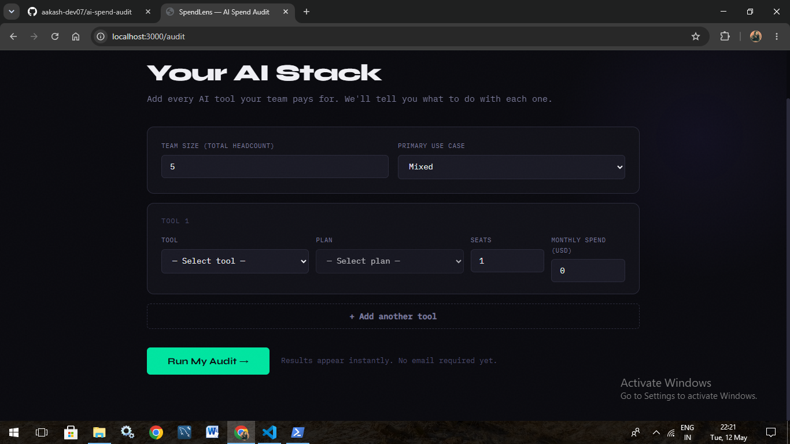
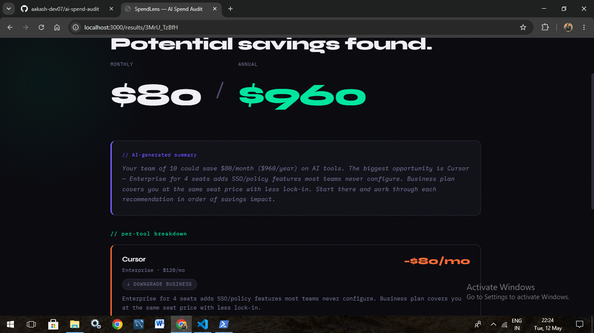

# SpendLens — AI Spend Audit

A free tool that audits your team's AI tool spend in under 
2 minutes. Tell us what you pay for — we tell you what 
to cut, switch, or keep.

Built for Credex's Web Dev Intern Round 1 assignment.

---

## Screenshots





---

## Live URL

https://your-app.vercel.app

---

## Run Locally

You need Node.js 18+.

```bash
git clone https://github.com/YOUR_USERNAME/ai-spend-audit
cd ai-spend-audit
npm install
cp .env.example .env.local
npm run dev
```

Open http://localhost:3000

The app works without an API key. 
Adding ANTHROPIC_API_KEY in .env.local enables 
AI-generated summaries — everything else works without it.

---

## Run Tests

```bash
npm test
```

---

## Deploy

```bash
npm install -g vercel
vercel --prod
```

Set ANTHROPIC_API_KEY in Vercel environment variables 
(optional).

---

## Decisions I Made

1. Next.js over plain React — needed server-side rendering
for unique OG tags on each audit's share URL. 
A plain SPA can't do this cleanly.

2. In-memory store over Supabase — removes database setup
from the critical path for MVP. The swap is one file 
(store.ts). Documented in ARCHITECTURE.md.

3. Rules engine for audit logic, not AI — financial 
recommendations need to be deterministic and testable. 
AI is used only for the summary paragraph on top.

4. Email captured after results — showing value first 
before asking for email. Users who see savings have 
a reason to give their email. Users who don't, won't 
anyway.

5. IBM Plex Mono + Syne fonts — monospace feels technical
and credible to the engineer audience this tool targets.
Most SaaS tools use Inter. This doesn't.